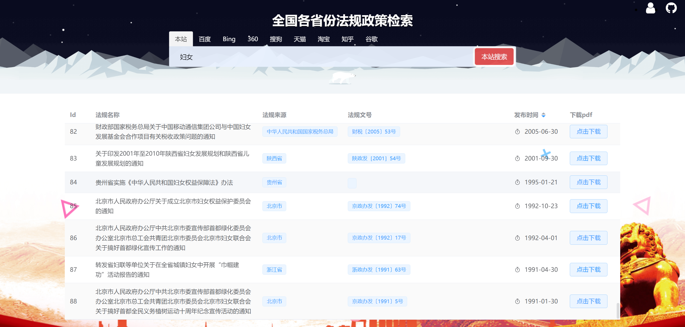

# 全国各省份各机构法律法规政策信息检索
目前爬取共70多个政府网站发布的法律及政策信息，包括中国内地所有省份以及国务院，人民代表大会，财政部，商务部等数十个国家机关发布的法律政策信息，共19万余篇，由于是接的公司的项目，数据就不对外公开，于是做成信息检索网站，仅供大家参考学习法律知识。



## 爬虫系统源码不对外公布，毕竟甲方爸爸给了钱的
也不用想着来爬本网站的数据,只能进行搜索
需要数据请联系:17628279559

所有数据都含有原网页html源码以及pdf版本，以及该法律法规的附件

## 网站架构
依旧是经典的vue3 加 flask,以及一些好用的库
搜索通过建立的倒排索引文件进行检索,并添加基础bool索引功能
没什么好说的,再次感叹vue全家桶的强大
以及自己的菜

## 下载依赖库
```
npm install
```

## 前端运行/构建
```
npm run dev

npm run build
```
## 后端运行
```
python run.py
```
